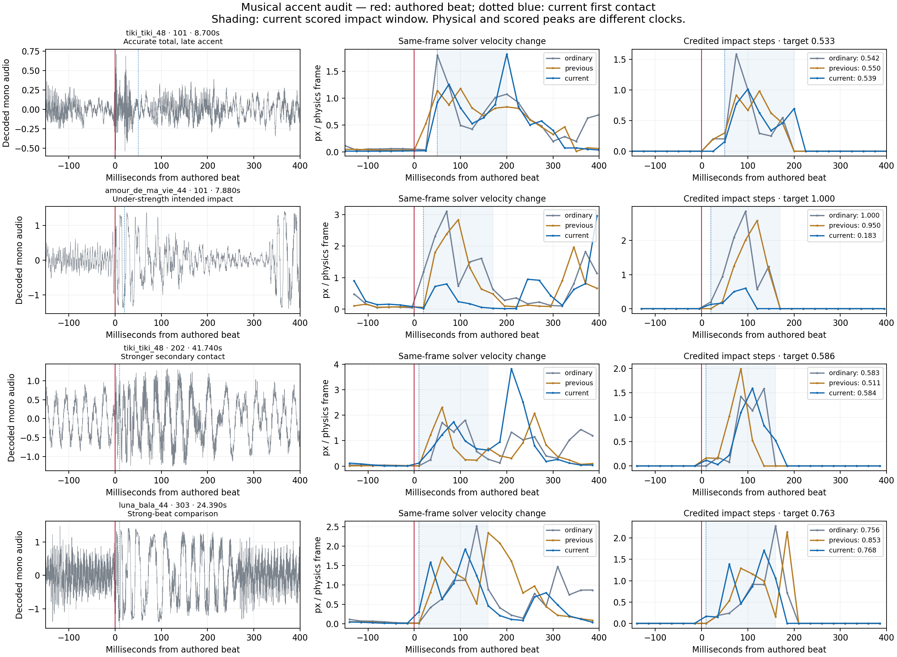
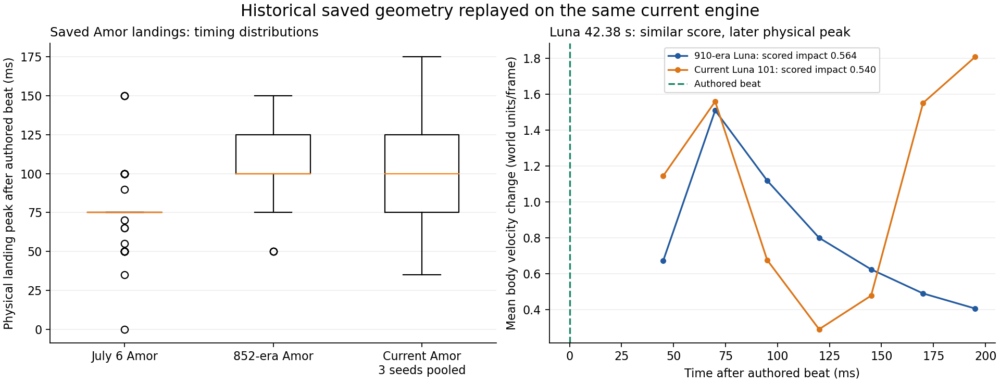
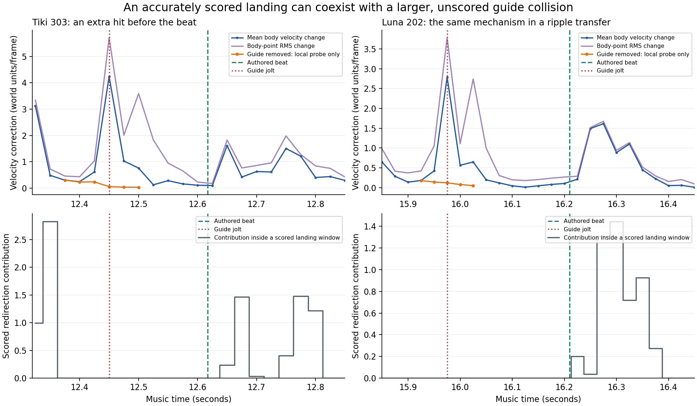
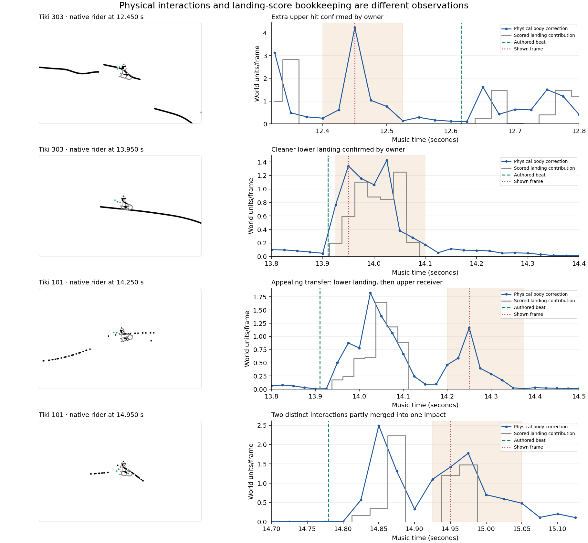
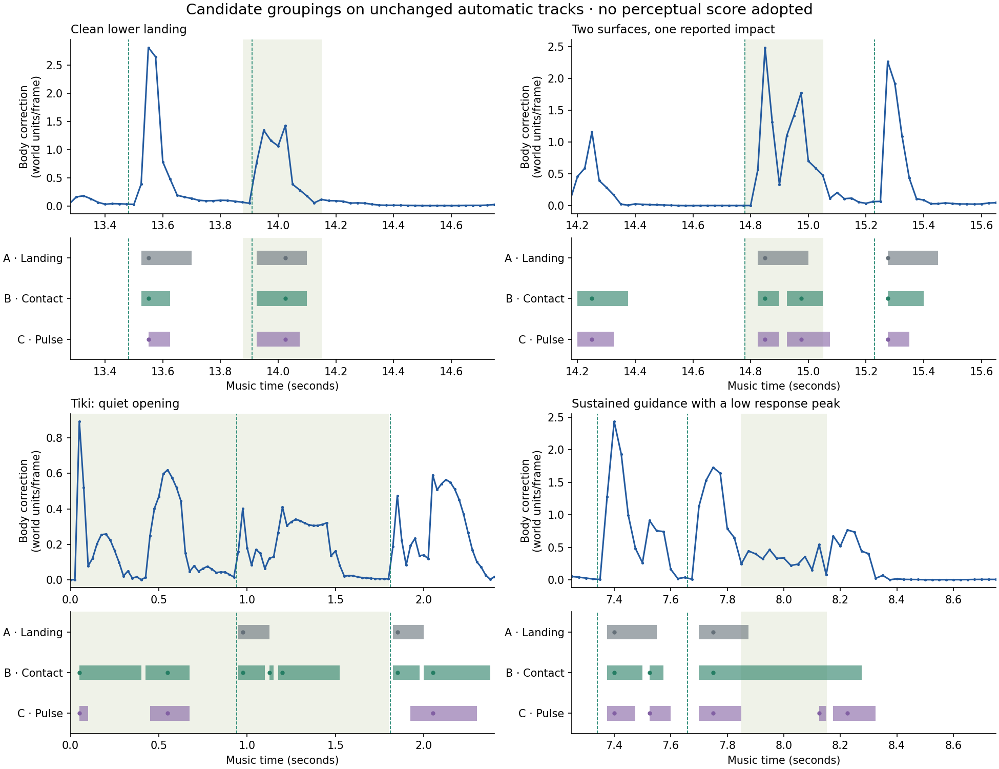

# Beat synchronization and perceptible impacts: investigation

The owner strongly endorses the delivered variety, geometry, originality and
motion. Preserve that direction. The new concern is that a rider's slam sometimes
does not feel synchronized with the music, despite a high headline score. The
request is to investigate first, without changing the compiler or prescribing a fix.

**There are measurable physical reasons for that impression. The evidence does
not point to a newly introduced dashboard clock shift or a recent impact-ruler
change.** First contact, accumulated impact, and the strongest visible response
are different events. The current contract constrains the first two, without
fully specifying the timing or prominence of the third. Some individual impacts
also fall substantially short of their existing targets.

This is not evidence that the latest motion work broadly damaged synchronization.
The preceding automatic arrangements have similar timing and worse aggregate
impact accuracy. The ordinary references remain more accurate in impact strength
and have fewer secondary contact events. Local regressions coexist with the
overall improvements. No production behavior, audio, saved track, scorer or
benchmark has been changed for this investigation.

## Scope and reproducibility

Replayed **36 records / 30 distinct tracks**: four production songs × three seeds
× current automatic, previous automatic, and ordinary reference. Ordinary has
six distinct tracks represented by twelve paired records; those copies are not
independent observations. Each version contains **945 authored contacts**, of
which **696 have authored impact ≥0.5**. Here “strong” is a diagnostic grouping,
not a newly calibrated aesthetic threshold. Sensitivity at 0.4, 0.6 and 0.8, plus
results deduplicated by track, are preserved.

Every saved audio/specification/analysis hash was checked. All lines are normal
type 0. All ten native physical point positions match every saved replay frame
exactly; the frozen judge reproduces every stored score and contact frame. Every
one of the 945 contacts in each version passes the existing ±1-frame timing gate.

- [Compact complete audit](evidence/beat-salience-audit-20261001.json.gz): all
  per-contact measurements, original record identities and contract assays.
- [Summary and mechanism probes](evidence/beat-salience-summary-20261001.json):
  all song/version groups, threshold sensitivity, playback measurements, selected
  examples and guide-removal comparisons.
- Large per-frame trajectories stay local under
  `generated/beat-salience-20261001/`; input hashes bind the compact evidence.

Reproduce on this checkout with the saved collections available:

```sh
LR_ENGINE=wasm node --import tsx scripts/gallery/study_beat_salience.ts
node scripts/gallery/check_beat_clock.mjs
python3 scripts/gallery/report_beat_salience.py
```

The browser command uses the running server at `http://127.0.0.1:8767` and
instruments responses in its own browser session. It does not edit the player.
The first replay-harness run encountered the two different audio-analysis schemas;
the harness was corrected to read both, then the complete panel was rerun.

## The clock is consistent; presentation is different

The native player reads `audio.currentTime`, multiplies by 40, and interpolates
the matching physical frames. There is no separately advancing animation clock.
Eight instrumented playback windows across all four songs, including seeks into
the music, captured **1,984 draws**. Visual time minus the sampled media time was
zero throughout. The worst per-window 95th-percentile draw interval was **17 ms**,
the largest interval **33.3 ms**, and the longest two-panel draw **4.2 ms**.
There was no accumulating software-clock drift in this test.

These are headless Chromium measurements on this host. They do **not** measure
speaker/Bluetooth latency, display scanout, browser behavior or dropped frames
on the owner's device. No precise owner timestamp/device reproduction has yet
been supplied for this new concern.

The dashboard camera is centered directly on the interpolated **PEG** point at
each frame, with fixed user-selected zoom. This holds that point stationary on
screen: the world translates around it, and the viewer sees body motion relative
to the sled. It does not apply the production camera's zoom plan or beat-punch
effect. Finished rendering adds an authored-impact-driven zoom pulse on selected
strong beats. That is a real presentation difference which could affect felt
accents; its perceptual contribution has **not** been established by an A/B review.
It also predates the latest compiler delivery and applies equally to native
current and reference playback.

## First contact is not the strongest response

Offsets below are relative to the **original authored musical times**, before
the production jolt and 40 Hz rounding. The physical peak is the largest
same-frame change between incoming and post-solver six-body-point mean velocity
within touchdown through touchdown+6. It excludes gravity already applied to the
incoming velocity. Position-derived motion gives similar timing, but neither is
a calibrated measure of a human observer's perceived instant of impact.

| Strong-beat observations (696 in each paired version) | Ordinary | Previous automatic | Current automatic |
|---|---:|---:|---:|
| Median first-contact offset | +40 ms | +35 ms | +35 ms |
| Median physical peak offset | +90 ms | +96 ms | +95 ms |
| 90th-percentile physical peak offset | +130 ms | +160 ms | +150 ms |
| Impact below 80% of its authored target | 0 | 102 | 87 |
| Impact below 50% of its authored target | 0 | 24 | 13 |
| Beat neighborhoods containing a detected bounce | 77 | 189 | 130 |
| Stronger physical peak after the landing window, before the midpoint to the next beat | 6 | 31 | 21 |

The last row is a conservative description of a later competing accent, not a
judgment that every such turn is undesirable. These rates are not population
estimates across unseen music. Counts include paired ordinary duplicates;
the distinct-track tables in the evidence preserve that distinction.

There is a common offset before physics even responds. `JOLT_DEFAULT_MS = -15`
and `applyJolt` subtracts that value, so it **delays authored contacts by 15 ms**.
Frame rounding makes the actual target shift +2.8 to +27.3 ms in this collection.
The current ride then lands on the rounded target in 366 cases and one frame
later in 579. The comment describing an earlier-contact compensation does not
describe what this negative default does. The setting is longstanding and is
identical for all comparisons, not a newly introduced regression. Changing its
sign alone is not demonstrated to resolve the concern: the subsequent physical
response varies by contact and construction.

## What the score does and does not establish

The impact formula, timing detector, normalization and musical evaluator are
unchanged between the preceding delivery (`ca97d100`) and this delivery. V6
changed arrangement/layout tasks, not that musical ruler. Its 835.6161 aggregate
is also not the score of every production song: current Amour examples score
roughly 581–599; other current production examples span roughly 768–873.

The existing impact measurement sums speed-weighted changes in body velocity
heading over seven contacted samples: touchdown and six more frames. At 40 Hz
the post-touchdown horizon is 150 ms. It does not require that bending be
concentrated at touchdown, nor explicitly locate the dominant jolt on the beat.
The engine's exposed stored velocity is the incoming velocity: the effects of
solving frame `f` appear in that velocity at `f+1` after gravity. The audit keeps
the existing scored clock and the same-frame physical clock separate, with
exact algebraic and replay checks. It does not silently “correct” the ruler.

A synthetic contract assay demonstrates the distinction: a turn concentrated
early, the same total turn spread over six samples, and the same turn concentrated
at the last sample all have **impact 0.5 and an impact-only score of 1000**.
Adding a later turn outside the window leaves that impact score unchanged. These
are detector-input examples of what the formula distinguishes, not claimed
physically realizable tracks or full benchmark runs.

The off-beat gate rejects extra **landings** after more than five airborne frames.
It does not reject every bounce, brief fly-through, body-only guide contact or
sharp redirection during continuous contact. Across the complete paired records:

| Detector events | Ordinary | Previous automatic | Current automatic |
|---|---:|---:|---:|
| Landings | 945 | 945 | 945 |
| Bounces | 271 | 406 | 329 |
| Fly-throughs | 12 | 9 | 27 |

Thus “no off-beat landings” does not mean “no additional physical accents.”
Likewise, impact error is averaged over contacts and then combined with other
axes. A high aggregate can coexist with locally weak hits. Both are limitations
of what a headline establishes, rather than evidence of changed score arithmetic.

## Concrete passages and causal checks

The following examples were selected to expose mechanisms, not as a representative
sample. The plot includes decoded audio as temporal context; waveform amplitude
alone does not identify the perceived musical beat.



**Tiki 101, authored beat 8.700 s: delayed physical emphasis despite accurate
impact.** Current folded support touches at 8.750 s. Target impact is 0.533 and
measured impact 0.539, but the largest physical response within the landing
window occurs at **8.900 s**, 200 ms after the authored beat. The ordinary
reference peaks at **8.750 s**, only 50 ms after it, with impact 0.542. Removing
this section's guide in an in-memory causal probe leaves the delayed peak and
impact exactly unchanged: its first guide collision is not until **9.150 s**.
The late accent here arises on the main support, not from an upper rail hit.

**Amour 101, authored beat 7.880 s: a genuinely weak intended landing.** The
current terraced transfer touches at 7.900 s but scores impact **0.183 against
1.000 requested**. Previous automatic reaches 0.950 and ordinary reaches 1.000.
This is a real local regression in an existing scored quantity, despite overall
improvement. Removing the guide leaves the weak landing's impact unchanged;
the first removed guide contact is at 8.100 s, after the measured landing window.
The later trajectory changes, so this is not a proposed guide-deletion fix.

**Tiki 202, authored beat 41.740 s: a stronger secondary accent.** The scattered
construction touches at 41.750 s and measures **0.584 against 0.586 requested**.
Its strongest landing-window velocity change is 1.731 px/frame, but another
contact at **41.950 s** produces **3.820 px/frame**, 2.21 times stronger. The
earlier brief shoulder/guide contact at 41.900 s matters: removing that section's
guides preserves the entire prefix to first affected contact and preserves the
scored impact exactly, while reducing the 41.950 s response to **0.0365**. The
largest response in the short modified replay becomes the original 1.731 landing
response. A guide can therefore create a later dominant accent without changing
the impact credited to the musical beat. This is a local mechanism assay, not a
complete, qualified replacement ride.

**Luna 303, 24.390 s: an improving comparison.** Current impact is 0.768 against
0.763 requested; its physical peak is 110 ms after the beat, versus 135 ms for
ordinary and 160 ms for previous automatic. The direction of change is not uniform.

These passages can be opened in the existing dashboard using the saved song/seed
and time; there is no separate diagnostic compiler or reauthored music.

## What remains open

The evidence supports separating three questions in the next discussion:

1. **Playback presentation:** compare the same saved ride with native and
   production camera behavior, without hiding physical timing behind an effect.
   A device-specific reproduction could additionally test actual audiovisual latency.
2. **Existing impact fidelity:** weak requested hits already have an objective
   error. Investigate search tradeoffs and local failures without assuming new
   geometry must be discarded. The latest campaign improves their aggregate but
   leaves substantial individual misses.
3. **Accent timing and competing motion:** agree what an intended musical accent
   should mean in a few listening examples before inventing a new optimization
   target. Track first contact, response timing/concentration, and secondary
   accents separately. Preserve quiet landings, useful expressive motion, and
   the positively reviewed variety.

No universal timing offset, guide ban, new benchmark version or added penalty is
justified by this study alone. The findings establish specific measurable issues
and counterexamples. They do not establish that one mechanism explains every
reported feeling or that all extra motion should be suppressed.

Validation: complete 36-record cold replay and score parity; three local guide
assays with exact prefix parity; four synthetic metric assays; eight browser
playback windows; **11 existing impact/recapture/overlay tests passed in four
test files**. The compiler and frozen contracts remain untouched.

## October 2: historical tracks and impacts between beats

The owner clarified that an upper-rail collision can create a visible accent
before an otherwise correctly scored landing. Preserve the established landing
impact definition and investigate the rest of the ride separately. Neither all
extra accents nor all guide contacts are undesirable by definition.

### Historical material recovered

There are **226 production videos from July 6–7** in
`generated/bundles/260706-235241/`: 76 Amor, 75 Luna and 75 Tiki. Their upload
metadata records compiler `e7c356e`. Individual production scores range from
654.1–686.2 for Tiki, 655.3–696.7 for Amor, and 713.1–757.2 for Luna. These are
not benchmark headlines. The July 17 output folder is empty; this search has
not recovered a specifically mid-July production batch. Most July bundles
retain videos and metadata rather than raw geometry.

The [inventory](evidence/historical-production-inventory-20261002.json) binds
all upload files and verifies video presence. Examples selected by earliest
upload time, not diagnostic outcome:

- [July Tiki](../generated/bundles/260706-235241/tiki_tiki_48s/tiki_tiki_48s-s946081389/video.mp4).
- [July Luna](../generated/bundles/260706-235241/luna_bala_44s/luna_bala_44s-s946081256/video.mp4).
- [July Amor](../generated/bundles/260706-235241/amor_na_praia_46s/amor_na_praia_46s-s946078955/video.mp4).
- [910-era Luna](../archives/arc-v3-910/luna_bala_44s/video.mp4), generated
  September 9 with seed 260908011. Canonical V3 headline 910.5248; this production
  track's score 905.3429.

One July 6 Amor geometry/report survives at
`generated/produce/_paritycheck/s946078916.track.json`, with its render log and
video. Its upload says `paritytest`, not a recoverable compiler hash. All 78
saved contact frames replay exactly and authored target times match the current
specification plus production jolt. No original full trajectory or audio hash
survives there; do not claim complete historical playback parity.

The study also replays three 852-era tracks and the 910-era Luna. Their archived
track/report hashes and current spec/audio/analysis identities match. All 305
contact frames and scored impacts reproduce. Twenty-four current/ordinary
records reproduce their full saved traces and prior diagnostic peaks. Total:
**29 records and 2,273 authored contacts**, not a multi-seed historical trial.

For 61 strong Amor beats, July's median physical landing peak is **75 ms** after
the beat, versus **100 ms** in the 852-era track and each current seed. Median
physical response share in the first two contact frames is **44.0%** in July,
versus **25.1–30.6%** currently. July measures weaker under today's impact ruler;
that does not refute cleaner perceived rhythm. The deliberate July 31 definition
change (`48dbda18`) prevents direct comparison of historical scores.

For Luna, the 910-era median peak is **100 ms**, versus **95 ms** currently:
there is no uniform timing regression. At **42.380 s**, however, the old track
has one decaying response, strongest at +70 ms. Current seed 101 also has an early
pulse at +70 ms, then a stronger pulse at +195 ms. Scored impact remains similar:
**0.564 / 0.540**, target **0.542**. Calling this only a late landing would miss
the split response.



### Continuous observations and causal checks

`scripts/gallery/ride_accents.ts` observes native frames without a landing gate:
mean body velocity correction, signed speed change, turning, and RMS corrections
of all six body points. The latter retains opposing movements cancelled in the
mean; its nontranslational part includes legitimate rotation and articulation.
These are kinematic quantities, not calibrated perceptual scores or forces.

Records include peak width/concentration, musical timing, nearby landing
strength, actual collision IDs and guide/support roles, plus the exact scoring
gates. Sweeps at 0.5/1/2 absolute units and 0.5/1/2 times the nearby landing peak
expose threshold sensitivity. No threshold becomes an artistic rule.

All **36 saved records** are replayed: 12 current, 12 previous, 12 ordinary
(only six distinct ordinary tracks). Mean correction matches the previous
independent frame audit within 1e-8. No compiler, judge, arrangement or player
change is involved.

| Passage | Before next beat | One-frame turn | Extra/landing peak | Next target / achieved | Jolt after guide removal |
| --- | ---: | ---: | ---: | ---: | ---: |
| Tiki 303, 12.450 s, S transfer | 167 ms | 22.75° | 2.62× | 0.657 / 0.640 | 4.238 → 0.059 |
| Luna 202, 15.975 s, ripple transfer | 235 ms | 15.25° | 1.73× | 0.659 / 0.651 | 2.790 → 0.123 |
| Luna 303, 9.950 s, scattered | 260 ms | 12.35° | 1.94× | 0.358 / 0.339 | 2.302 → 0.034 |
| Ordinary Amor 101, 23.175 s, paired arc | 225 ms | 11.37° | 1.63× | 0.624 / 0.619 | 2.332 → 0.065 |

Each guide deletion preserves all ten rider-point positions exactly until first
removed contact, and preserves the earlier completed landing impact. Probes
end shortly after the jolt, before the next landing. This establishes local
causation, **not** a valid replacement or preservation of the next target.

The three current examples slow the rider by 0.83, 0.52 and 0.20 units/frame.
Positive-speed-gain limits therefore miss them. They are outside all scored
landing windows; the next stored-velocity frame is also airborne under the sled
detector, so its contact-gated redirection contribution is zero. Tiki is labeled
a **kick** on the next frame; the other two have no detector event within four
frames. An off-beat-*landing* gate does not prohibit every forceful collision.
The search's direction/absolute-correction residuals apply only below requested
impact 0.2 and average over the interval; these energetic passages are outside
that calm-specific rule. This is a coverage gap, not a recent scorer change.

A fifth positive probe, Amour 101's terrace guide at 7.725 s, reduces correction
**2.170 → 0.046**. It lies at the tail of the previous landing window while nearer
the next beat, making temporal attribution ambiguous. A **negative control**
removes Luna 101's final guide: the second pulse at 42.575 s remains **1.807**,
with identical trajectory throughout the assay. That support pulse precedes
the first guide contact at 42.650 s. Guides do not explain every split hit.



### Population evidence and limits

Descriptive screen: correction ≥1, outside every physical landing window, >75 ms
from the nearest beat, stronger than that landing's peak, and authored impact
≥0.5. Each collection below contains 696 strong beat occurrences:

| Collection | Extra peaks | Before / after nearest beat | Recent guide contact | Slowing down |
| --- | ---: | ---: | ---: | ---: |
| Ordinary | 16 | 10 / 6 | 16 | 0 |
| Previous automatic | 43 | 9 / 34 | 31 | 23 |
| Current automatic | 34 | 12 / 22 | 30 | 17 |

These are peaks, not independent affected beats or listener judgments.
Deduplicating ordinary gives 8 peaks / 394 strong beats / six tracks; both views
are saved. Raising the absolute floor to 2 gives 4 / 22 / 17; requiring >2× the
landing peak gives 0 / 7 / 2. Guide proximity is association except in the
explicit causal probes.

The direction is not universal. Across **all** target strengths, the same
screen gives **94 / 143 / 78**: current automatic improves the broad count over
ordinary, while retaining more competing accents around strong beats. Minimizing
all jolts would misrepresent the evidence and suppress useful motion. Extra
body-point movement is likewise diagnostic, not automatically a flaw.

This establishes several concrete instances of the owner's mechanism, not that
it explains most of the perceived problem. Weak intended hits, split support
responses, musical context and camera presentation remain relevant. The owner
subsequently confirmed the Tiki listening example; see the follow-up below for
the positive comparison and clarified intent.

Keep the landing metric and frozen benchmark. Use complementary observations
for landing concentration, extra accent dominance/timing, body response, and
collision provenance. Before defining a new scalar, compare welcome transfers
and unwelcome jolts across ordinary/new geometry and quiet/energetic passages.
Next causal compiler studies should test gentler or distributed receiver
engagement with matched incoming states and full suffix reconstruction. Preserve
requested geometry and the possibility of useful accents at musical subdivisions
not represented by the contact specification.

Evidence: [summary](evidence/ride-accents-summary-20261002.json),
[whole-ride audit](evidence/ride-accents-audit-20261002.json.gz),
[historical audit](evidence/historical-impact-audit-20261002.json.gz).
Raw frames stay local under `generated/ride-accents-20261002/` and
`generated/beat-salience-history-20261002/`. Reproduce with
`study_historical_impacts.ts`, `study_ride_accents.ts`, and
`report_ride_accents.py` in `scripts/gallery/`.

Validation: 36 accent replays, 29 historical/current replays, five positive
probes plus one negative control, **64 tests passing in five files**, and browser
verification of the linked Tiki passage (native replay loaded, music advanced,
no page errors). The repository TypeScript check still reports 251 diagnostics;
none are in the added investigation files. No global clean-build claim.

## October 2 follow-up: welcome upper receivers and merged impacts

### Owner feedback and intended outcome

The owner confirmed Tiki 303 at **12.45 s** as the distracting upper hit, and
identified the landing around **13.95 s** as cleaner and better defined. They
also explicitly welcomed Tiki 101's separate lower-to-upper transfers around
**14.2 s and 14.95 s**. The second transfer illustrates a musically ambiguous
second hit, not a request to remove that kind of movement.

The desired result includes both smooth guidance toward a later musical hit
and deliberate musical strikes against upper geometry. A receiver without a
parallel lower rail is an attractive possibility. Sustained inverted sled
riding would be another valuable possibility. Strong steering is not inherently
bad, and overhead geometry need not always be smooth. The question is whether
the interaction delivers the intended musical experience.

This clarification broadens the earlier proposed direction of gentler receiver
engagement. Smoothing every upper collision would discard something the owner
wants. Counting every contact as another beat would also be inappropriate.
Keep the established landing impact reference while investigating physical
interactions and their musical attribution separately. No new roadmap, aesthetic
scalar, search penalty, benchmark, or production policy is introduced here.

### Named examples, native replay and exact score accounting

The new study replays the two saved Tiki tracks, reproducing **all ten point
positions at every frame exactly** through the specification duration. Every
nearby scored impact also reproduces. All segments are normal, non-accelerating
lines. Native-renderer screenshots show the actual rider and track; the browser
reported no page errors.

| Passage | Actual physical interaction | What the current system records |
| --- | --- | --- |
| Tiki 303, 12.400–12.500 s | Upper receiver; peak correction 4.238 at 12.450, turn 22.75° in that frame | No scored landing window contains the peak. Detector emits a kick at 12.475; the next landing is 12.650. |
| Tiki 303, 13.925–14.075 s | Continuous lower contact; peak correction 1.427, maximum one-frame turn 7.68° | One landing at 13.925, impact **0.674**, target **0.718**. No guide in this section. |
| Tiki 101, 13.950–14.350 s | Lower contact through 14.125, then upper receiver from 14.200–14.350; one late lower tail touch at 14.350 | Lower landing impact **0.705**, target **0.718**. Upper contact is shoulder/hands, outside that score window. No separate upper landing event. |
| Tiki 101, 14.825–15.025 s | Lower contact 14.825–14.875; one frame without contact; upper receiver 14.925–15.025 | One lower landing with impact **0.719**, target **0.740**. Part of the upper interaction enters this same number. No separate upper landing event. |

These physical corrections are body-mean velocity changes, not the scored
impact unit or a calibrated perceptual scale. The 14.200 transfer's peak is
1.162 with a maximum one-frame turn of 6.35°. The 14.925 receiver's peak is
1.776 at 14.975, with a maximum turn of 9.69°. The preceding lower contact's
peak is 2.490. Different intensities alone do not decide which interaction is
artistically appropriate.

In the last example, the score uses stored frames **593–599**
(14.825–14.975 s). Its nonzero raw redirection contributions are:

| Stored frame / time | Raw contribution | Physical interpretation of preceding solver frame |
| --- | ---: | --- |
| 593 / 14.825 | 0.171 | Arrival term before the lower collision response |
| 594 / 14.850 | 0.346 | Lower contact |
| 595 / 14.875 | 2.225 | Lower contact |
| 598 / 14.950 | 1.202 | Upper contact |
| 599 / 14.975 | 1.481 | Upper contact |

The authored beat is **14.780 s**: the lower contact starts 45 ms later, the
upper contact starts 145 ms later, and its physical peak is 195 ms later.
There is no separate authored contact at the upper hit; the next is 15.229 s.
That does not establish whether the music contains an attractive subdivision
there, but it shows what this specification is actually asking the compiler to
hit.

The engine's stored velocity at frame `f+1` contains the response at `f` plus
gravity. These timestamps are kept explicit. The scalar is gated by sled
contact at the stored frame: there are zero contributions at frames 596 and
597. The strongest upper response at frame 599 is not directly included on
the next frame, which is airborne and outside this window. Thus the upper
interaction is **partly merged and partly omitted**, rather than simply absent.

The 14.925 receiver first meets hands and shoulder; STRING contact occurs at
14.950 and 14.975. Two grounded frames out of the five-frame persistence window
do not produce a separate detector event after this short airborne interval.
Neither the compiler section boundary nor the appearance of a second surface
automatically creates a musical target.

### Local causal checks

Three receiver-deletion probes preserve all ten rider-point positions exactly
until the first removed collision. Each measures the complete original landing
window and stops before the next original landing. These are attribution
experiments, **not replacement tracks** or proofs that a continuation works.

| Removed guide | First divergence | Earlier landing impact, original → altered |
| --- | ---: | ---: |
| Tiki 101, section 19 | 14.200 s | **0.705255 → 0.705255** |
| Tiki 101, section 20 | 14.925 s | **0.718520 → 0.363197** |
| Tiki 303, section 15 | 12.400 s | **0.702020 → 0.702020** |

For Tiki 101 section 20, the lower contact and its incoming state are identical,
but removing the later upper receiver removes **49.45%** of the recorded raw
landing impact (5.424825 → 2.742140). This verifies the attribution problem
causally, rather than inferring it only from nearby collision IDs. It does not
show that deleting the receiver sounds or looks better. The owner likes the
possibility of this second interaction.

The positive Tiki 303 comparison is also informative: its cleaner lower
landing spreads over seven contact frames and has more than one local response
maximum. "Minimize peak width" or "allow only one local maximum" would not
capture the owner's distinction. What is mechanically clear in this case is
one continuous lower-surface engagement, without an intervening upper receiver.



Orange shading marks contact with the surface discussed in each panel; in the
clean lower example it marks the lower surface. Gray is the contribution inside
existing landing windows at its stored-frame timestamp. It is not a second
independent measurement of physical impulse.

### Can an upper hit already count as an impact?

Yes, in some circumstances. The current detector checks **which rider points
contact**, airborne duration, and persistence. It does not require the surface
to be below the rider. The landing scalar uses velocity redirection and sled
contact, without a world-up or surface-normal restriction. A synthetic 180°
rotation of the same contact/velocity sequence preserves both its landing event
and impact exactly. This checks the measurement contract, not realizability
under the actual gravity or capability of the current search.

Persistent contact after more than five airborne frames can be a landing.
Persistent contact after a shorter flight is a bounce; the authored-event
contract accepts that only for detector-limited short target intervals. Body-only
contacts and brief sled touches follow other paths. Consequently an upper
receiver can be recognized as a landing, missed as a distinct event, or partly
absorbed into an earlier impact window. "Upper" and "guide" are not synonyms
for "unscored."

A geometric screen across **36 saved records / 30 distinct tracks** finds 105
brief inverted-contact runs, counting repeated ordinary tracks. It requires
the body mean below both ski endpoints, shoulder below butt, and an actual
TAIL/NOSE collision. The longest run is four frames. This strict screen excludes
tilted and vertical configurations and can include a pivot on one ski endpoint
or simultaneous contact with another surface. Native inspection of the looser
Tiki 303 candidate at 7.975 s shows why position-only screening is insufficient:
the rider is rotated around a contact, not demonstrating a sustained overhead
slide. **Repeatable, intentional inverted riding remains unvalidated**, not
ruled out.

### What this establishes for the next discussion

The visual concern is concrete and has at least two mechanisms: a forceful
interaction outside the scored windows, and two separate surface engagements
contributing to one otherwise accurate landing score. A high scalar score does
not establish that the intended musical hit is individually clear.

The compiler currently plans a construction interval from one authored contact
to the next. It checks the starting contact, the achieved impact, interval
motion and construction fulfillment; it rejects extra detected landings. It
does not independently assign musical intent to every upper collision within
that construction. This explains how the observed behavior can pass its
existing checks without implying that the new geometry itself is unsuitable.

Useful further measurements should preserve actual point/surface contacts,
free-flight intervals, turning and response timing, alongside existing impact.
Then we can distinguish a lower musical strike, a deliberate upper musical
strike, and guidance between strikes in concrete examples. These are intended
uses to investigate, not a new mandatory specification schema or an automatic
classification already solved by this study. An artist should not have to
manually assign every rail.

Remaining questions include how to identify perceptually distinct interactions
without counting continuous sliding as repeated impacts, how to assess body-side
versus sled-side upper hits, and how to target an upper musical strike while
retaining safe, expressive continuation. We have not established that one scalar
or one threshold answers those questions. Preserve the well-calibrated lower
landing reference and the owner's welcome transfers while investigating them.

Evidence: [summary](evidence/interaction-roles-summary-20261002.json),
[focused audit](evidence/interaction-roles-audit-20261002.json.gz).
Reproduce with `scripts/gallery/study_interaction_roles.ts` and
`scripts/gallery/report_interaction_roles.py`. With the dashboard server running,
`scripts/gallery/capture_interaction_roles.mjs` captures the figure's native
screenshots at zoom 3 and records their checksums. They are saved locally under
`generated/tiki-interactions-20261002/`. The full raw replay corpus stays local.

Validation: two exact full-duration replays, all nearby impact sums reproduced,
three causal probes, the orientation contract assay, the 36-record pose screen,
and **63 tests passing in four files**. TypeScript with
`--allowImportingTsExtensions` still reports the existing 251 diagnostics; none
are in the new study. No compiler, physics, scoring, specification or playback
behavior changed.

## October 2 candidate comparison on a declared musical panel

The first calibration milestone from the
[working agreement](intentional-motion-roadmap.md#october-2-working-agreement-establish-meaning-before-the-next-campaign)
is now implemented. Its result is a comparison with explicit counterexamples,
not a new impact definition. **No compiler, physics, specification or benchmark
meaning changed.** This work uses the same saved automatic arrangements and the
same native observations as the preceding investigations.

The [16-passage panel](evidence/interaction-panel-20261002.json) was committed as
`90b7c805` before executing these candidate groupings. It includes the owner's
named examples, lower-surface counterexamples, quiet openings, a brief inverted
contact, and sustained guide contact. Six additional passages were selected
using authored strong/quiet/contrast targets rather than diagnostic outcomes.
The sustained-contact control was selected mechanically from existing observations:
at least eight consecutive guide-contact frames, peak body correction at most
0.8, then largest summed absolute turning. That selection is **not** a finding
that the owner considers it smooth. This is a development panel with contextual
controls, not a blind validation set.

### What was actually compared

The study processes all twelve current automatic tracks, including the saved
20-frame post-song grace, and all **945 authored beats**. It detects and associates
events on the complete traces before clipping passages for display. Every
original landing's seven-frame window is present and reproduces its previously
saved peak. Track hashes, record hashes and source observation hashes are checked;
all track lines remain ordinary type 0 lines.

| Interpretation | Working definition | Deliberate limitation |
| --- | --- | --- |
| A: landing plus supplementary observations | Keep the existing landing event and calibrated impact unchanged; expose other whole-ride response peaks beside it | Supplementary observations reuse C below. A is not a third independent detector or a solution to merged attribution |
| B: contact episodes | Maximal consecutive actual contact by any rider point; no response floor | One empty frame separates episodes, even when the interruption might be visually unimportant |
| C: response pulses | Body-mean correction peaks near current or preceding contact; merge peaks without a sufficiently deep intervening trough | Grouping depends on provisional response and valley thresholds; mean body response is not a calibrated measure of felt impact |

B and C receive only frame time, body correction and a contact boolean. Geometry
IDs, construction names, support/guide roles and which side of the rider a
surface occupies are not grouping inputs. Relabeling those identities cannot
change the output. This is not a claim that physically retessellating a track
leaves the engine's motion unchanged.

Body correction is the previously measured difference from the incoming motion
after gravity, in world units per frame. It is a mean over body points, not a
mass-weighted force or a perceptually calibrated strength. The separate point-RMS
and heading observations remain available in passage data. We did not adopt a
strength normalization or compare a calibrated 0–1 landing impact directly with
this raw correction.

A's bands retain the original stored-frame scoring windows. A physical response
at frame `f` enters the stored velocity at `f + 1`; the supplementary peak-credit
check tests that following frame against both the window and sled-contact gate.
The response maximum shown inside an A band is descriptive body motion, not
the largest contribution to the established landing scalar. The previous exact
score reconstruction remains the reference for that attribution.

B is swept over zero, one and two allowed empty frames. C is swept over floors
0.25, 0.5 and 1.0, and valley fractions 0.25, 0.4, 0.6 and 0.85. Its default is
floor 0.5, valley fraction 0.4; interval extent uses 20% of the grouped peak.
Those are research settings, not thresholds an artist needs to approve.

Beat association is monotone and one-to-one: maximize matches within a declared
time tolerance, then minimize absolute timing error. Unmatched interactions,
unmatched requests and alternative eligible beats remain in the evidence. We
compare onset and peak clocks at 50, 100, 150 and 200 ms tolerance. Native
sampling is 25 ms; sub-frame precision is not inferred from these observations.

### Findings that constrain the design

1. **The welcomed two-surface Tiki interaction is distinguishable.** Around
   14.825–15.025 s in Tiki 101, default B and C separate the lower and upper
   responses. All twelve tested C parameter combinations retain two responses
   in the declared focus. Allowing just one empty contact frame in B merges
   them. This remains the example where deleting the later guide previously
   removed 49.45% of the earlier landing's reported raw impact. A generic
   gap-bridging rule would erase a distinction the owner explicitly sees.
2. **A clean landing can have more than one response peak.** Both default methods
   retain one interaction for the owner's positive Tiki 303 example around
   13.95 s. Raising C's valley fraction to 0.85 splits it into two. Counting
   every local maximum is not an adequate explanation of a musical strike.
3. **Quiet contact must not disappear merely because it is quiet.** Tiki 101's
   established landing near 0.975 s has a body-response peak of about 0.40 and
   disappears under C's default 0.5 floor. B retains it. Across the swept pulse
   settings, the Tiki opening has 0–5 overlapping pulses and Luna's has 1–9.
   This concerns detection, before any question of strength calibration.
4. **First contact is not automatically the meaningful onset.** In the additional
   Amour 202 strong-target control, a tiny contact at 5.550 s (peak about 0.02)
   receives B's match to the 5.5293 s beat. A stronger engagement at 5.600 s
   (peak about 2.19) remains unmatched. C instead associates the stronger
   response with that beat. Bridging the brief interruption changes B's answer,
   but the same operation merges the desired Tiki distinction above. No owner
   judgment about this new Amour example is being assumed.
5. **Contact and accents inside contact are different questions.** In Amor 101,
   actual contact continues from 7.700–8.250 s, across the declared 7.85–8.15 s
   focus. B reports one engagement. C marks 0–4 pulses overlapping that focus
   across its settings; the default local peak at 8.125 s is about 0.544.
   Whether this feels like continuous guidance or a separate accent is an open
   perceptual question, now presented in the native review. The earlier larger
   physical peak is also shown in its surrounding context.
6. **An unassociated interaction is not necessarily undesirable.** The welcome
   Tiki transfer around 14.20–14.35 s remains separate in both defaults without
   an authored beat association. The owner-confirmed distracting upper response
   around 12.45 s in Tiki 303 is also separate and unmatched. The same structural
   fact does not establish the same artistic judgment.



Shading identifies the declared focus; context on either side is retained.
Dashed lines are authored beat times. Candidate intervals overlap the focus
when their extent reaches it, even when their strongest peak lies outside it.

### Corpus totals are diagnostic counts, not a new headline score

At the default 100 ms onset association:

| Candidate | Observed episodes/pulses | Authored beats associated | Unmatched observations |
| --- | ---: | ---: | ---: |
| B: contact, no empty-frame bridging | 1,486 | 945 / 945 | 541 |
| C: response, floor 0.5 / valley 0.4 | 1,497 | 899 / 945 | 598 |

The extra observations include startup, welcome transfers, guidance and the
post-song continuation. **541 and 598 are not counts of bad impacts.** Likewise,
B's 945 matches do not establish perfect musical clarity: the weak-touch Amour
example demonstrates how a formally successful match can be questionable.

B produces 1,192 episodes with one empty frame allowed, and 1,081 with two;
943 and 942 beats respectively remain associated. Across C's twelve settings,
the number of pulses varies from 1,113 to 2,135 and associated beats from 800
to 930. At valley fraction 0.4, reducing the floor to 0.25 recovers 930 beat
associations; raising it to 1.0 retains only 801. These changes are interpretation
changes on identical physical rides, not compiler gains or losses.

Timing convention matters as well: at 100 ms, using peak time rather than onset
reduces associated beats to 616 for B and 634 for C. Response peaks commonly
occur after first engagement. This does not show playback drift or establish
which instant the listener perceives as carrying the beat. Fitting a strength
scalar before resolving identity and onset would hide this uncertainty.

### Review, validation and the next decision

The [musical review](http://localhost:8767/motion-gallery/production.html?review=/generated/interaction-candidates-20261002/review.json&clip=merged-hits)
uses the existing native rider, audio clock and production renderer. Each
passage has lead-in/continuation, an adjustable speed and zoom, a full-track
link and optional measurement timelines. Measurements are collapsed initially
so the ride can be judged first. Their record hash and track hash must match
the loaded native ride before they can be displayed.

Optional notes and marked music times stay in browser-local storage. An export
includes panel, candidate and track identities. Existing owner feedback is
distinguished from unlabeled cases and our provisional findings. Nothing is
automatically submitted or treated as an owner judgment.

Browser validation loaded all sixteen passages, exercised playback, automatic
excerpt stopping/restarting, chart seeking, notes across passage changes and
reloads, export identities, rapid selection changes, and the ordinary production
view. An injected valid-checksum/wrong-track study was rejected with playback
disabled and no stale measurement display. Mobile layout has no horizontal
overflow. Browser validation reported no page errors. The playback check first
waits for `audio.play()` to resolve before waiting for the automatic pause;
otherwise the initial Play label can make a test falsely conclude playback has
already finished.

The candidate and existing impact/contact suites pass **70 tests in five files**.
Repository TypeScript with `--allowImportingTsExtensions` still reports the 251
existing diagnostics, none in the new candidate or study code. No compiler
benchmark was rerun: no track-generating or scoring behavior changed.

Neither B nor C is ready to become the product contract. The useful direction
is to keep actual engagement and its time-resolved response available together,
then determine which interval and onset correspond to an intended musical
interaction. This is a direction to test, not an already-validated hybrid
formula. Strong guidance, separate upper strikes and quiet lower landings must
remain representable by the same account; a surplus marker alone cannot become
a penalty. The next owner check is the sustained-guidance example above, with
the weak-touch Amour case available as a second disagreement if useful. Existing
positive and negative Tiki judgments need not be relabeled.

Before a long optimization campaign, the eventual choice still needs new
validation passages, strength calibration, and a bounded construction assay
that intentionally places an upper musical receiver and checks its continuation.
This comparison did not demonstrate sustained inverted skiing or solve upper
receiver search. Frozen V6 remains a historical comparison until any successor
contract is explicitly defined.

Evidence: [summary](evidence/interaction-candidates-summary-20261002.json),
[full derived audit](evidence/interaction-candidates-audit-20261002.json.gz),
[browser validation](evidence/interaction-candidates-browser-20261002.json).
Run `node --import tsx scripts/gallery/study_interaction_candidates.ts`, then
`python3 scripts/gallery/report_interaction_candidates.py`; with the gallery
server running, use `node scripts/gallery/check_interaction_review.mjs`.
The raw replay archive, saved production records, browser screenshots and media
remain local. Code and the compact derived evidence are retained in Git.
