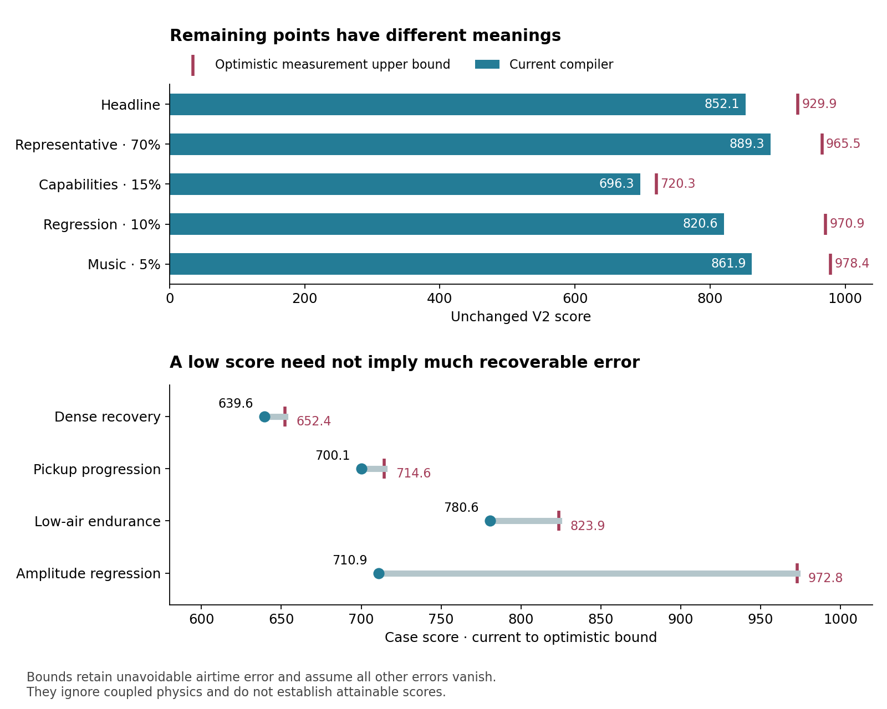
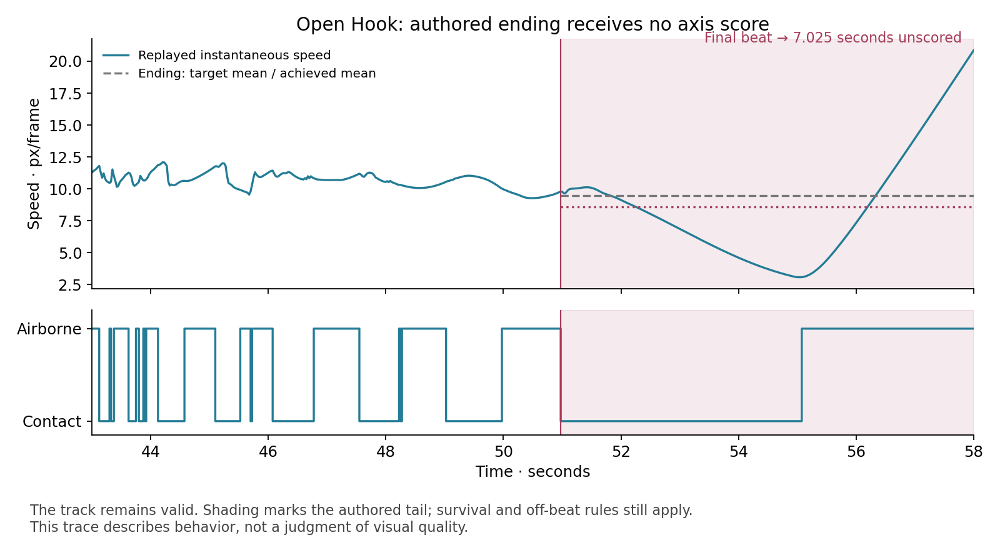

# Benchmark V2: alignment, headroom, and a useful next version

Review date: 2026-09-09. Reference: **arc-control-memory, 852.1248**, canonical 750k, all 44 development cases, seeds 16–23. The benchmark, scorer, detector, compiler, and active baseline are unchanged by this review.

**An extension is justified. The strongest reasons are uncovered product intent and limited independent evaluation, rather than the headline being uniformly close to its maximum.** Some capability cases are already close to a ceiling imposed by the measurement contract. Other cases retain substantial numerical headroom. Meanwhile, several seconds of authored endings receive no axis score, and the headline cannot establish whether a video has the desired visual character.

The recommendation is to preserve V2 as a historical anchor and develop a separate, versioned pilot. Its purpose should be to distinguish better realization of musical and visual intent. A lower initial headline would be an incidental result, not an acceptance criterion.

## What was examined

This review followed the [authoritative contract](benchmark-v2-context.md), [catalog](../benchmark/v2/catalog.ts), [policy](../benchmark/v2/policy.ts), source and suite manifests, materialized variants, source listening review, evaluator, target resolution, detector, axis measurements, aggregation, comparison decisions, impact calibration history, and recent compiler evidence. Earlier V1/V2 scores and responsiveness studies were treated as historical evidence across their respective ruler boundaries.

The new empirical work:

- Verified the promoted compressed and uncompressed archive hashes; checked all 352 reports, scores, and physical-frame counts against the 44 retained geometries.
- Reconstructed those 44 tracks with the exact canonical WASM artifact. **104,300 replayed frame samples reproduced every measurement in all 4,056 scored gaps exactly**, including impact. The additional 44 tail intervals explain the 4,100 geometry intervals in the compiler campaign audit.
- Audited every scored airtime target against a necessary detector constraint and frame quantization; calculated upper bounds through the actual unchanged scorer and hierarchy.
- Measured final tails and within-gap motion; ran explicit report counterfactuals and synthetic measurement fixtures.

The [analysis evidence](../benchmark/v2/studies/v2-alignment-review.json) and [cold-replay evidence](../benchmark/v2/studies/v2-alignment-replay.json) contain per-case and per-gap results. Report counterfactuals are analytical tools: they do not represent newly generated, physically achievable tracks. Whole-video aesthetic judgments were not collected in this review.

## What V2 gets right

V2 asks a sensible product question: can finite compiler compute realize interacting musical intentions over approximately minute-long tracks? Its coherent phrases, pickups, recovery passages, cadence changes, supported rideouts, and amplitude programs are a substantial improvement over isolated feature probes. These capabilities already exist in the suite; adding another case with a familiar label would not automatically improve coverage.

The 44 cases comprise 21 normative parents and 23 deliberate variants. The fixed hierarchy gives 70% to representative behavior, 15% to capabilities, 10% to regression material, and 5% to development music. Parent normalization prevents adding variants from silently increasing a family's influence. Undefined axes genuinely leave the compiler free; missing required measurements invalidate a run. Neither duration nor contact count automatically multiplies a case's weight. These are useful design choices. [Contract](benchmark-v2-context.md)

The owner approved the musical click-track review on July 12 without compiler or qualification outcomes. That outcome-blind authoring is worth preserving. It validates musical plausibility and phrase coherence, rather than the visual quality of generated tracks. [Signed listening review](../benchmark/v2/evidence/listening-review.json)

The impact measurement also has substantive design evidence. It sums contacted center-of-mass redirection, retains bend-then-unbend intensity, excludes airborne bending, and uses a deliberately calibrated felt ruler. Its 7.55 upper anchor is a perceptual/compatibility choice, not a claim about the maximum physical impulse. Expanding that ruler merely to make scores lower would discard useful work. [Current impact definition](impact_definition.md)

Finally, provenance is strong: literal seed schedules, fixed physical-work budgets, scorer and compiler identities, paired comparisons, archived reports, and exact cold-replay reproducibility. The present findings concern what this trustworthy measurement system measures.

## Is it saturated?

**Partly, and unevenly.** All canonical runs are valid. Fourteen of 44 cases exceed 900; none reaches 950. The case median is 868.52, with scores from 626.50 to 941.34. The headline is a nonlinear aggregate, not a percentage of requirements fulfilled.

For each valid run, V2 computes RMS error separately over the targeted gaps of each axis, combines their squared errors using active-axis weights, and applies:

`score = 1000 × exp(−weightedAxisRms / 0.25)`

Air, speed, and impact each receive 30%; amplitude receives 10% where authored. Absent axes are removed and weights renormalized. Shifted geometric means aggregate seeds, parent variants, and parents within groups; fixed arithmetic weights combine groups and strata. The active campaign measures 750k only. Historical 250k/500k/750k headlines are a different comparison scope. [Evaluator](../scripts/v0/benchmark_v2/evaluator.ts)

### A substantial part of the apparent deficit is unavoidable

A normal contact must follow at least **six consecutive airborne frames**. At 40 fps, a scored gap of `d` frames measures air over `d + 1` inclusive samples. For a non-startup interval with `d ≥ 7`, a valid landing can be at the target frame minus one, exactly on it, or plus one. In all three cases, its six immediately preceding airborne frames lie inside the scored interval. Therefore:

`achievedAir ≥ 6 / (d + 1)`

Furthermore, measured air must be an integer multiple of `1 / (d + 1)`. The audit finds the closest admissible fraction for each gap. It conservatively omits the six-frame floor for startup and short intervals, where the bounce exception matters. The bound held across every saved report and every cold replay. It follows from the [detector](../scripts/lib/detector.ts), [contact eligibility](../scripts/v0/core/substrate.ts), and [air reduction](../scripts/v0/core/measure.ts), rather than an estimate of compiler ability.

**471 gaps across 16 cases request air below that landing floor.** These are not exclusively tiny discrepancies: 327 require at least 0.05 unavoidable error, and 216 require more than 0.10. One seven-frame pickup requests approximately 0.182 air; any eligible landing requires at least 0.75. The current compiler delivers 0.75 there.

Keeping only unavoidable air errors, setting every other error to zero, and applying the unchanged hierarchy yields this optimistic upper bound:

| Scope | Current | Measurement upper bound |
|---|---:|---:|
| Headline | 852.1248 | 929.9207 |
| Representative | 889.3333 | 965.5215 |
| Capability | 696.2646 | 720.3388 |
| Legacy regression | 820.5666 | 970.8525 |
| Development music | 861.9021 | 978.3918 |

**These bounds are not attainable-score predictions.** They ignore coupled physics, geometry, adjacent intervals, and all other axis conflicts. They establish that even a hypothetical perfect solution to those remaining problems cannot reach 1000 under the present contract.



The dense-recovery parent illustrates the consequence: its score is 639.59, but this necessary-condition bound is only 652.41. By contrast, amplitude regression scores 710.94 against a bound of 972.85. Reading both as similarly unsolved would direct research poorly.

Across pooled observations, unavoidable airtime error accounts for **83.74% of current squared air error**. This is an observation-level diagnostic, not a decomposition of the weighted headline. The existing frontier has become substantially constrained by the definition of an eligible contact.

The right response is an authoring/semantics review in a new version. If the desired beat must be a landing after distinct flight, the request must be compatible with that event. If a strongly articulated supported turn should count, that is a different contact concept requiring explicit validation. Silently clipping targets, accepting incidental contact noise, or weakening the detector to manufacture better scores would evade the question.

### There is still useful numerical headroom

Analytically perfecting one axis while leaving all other measurements unchanged produces:

| Hypothetical report change | Headline gain |
|---|---:|
| Zero air error, ignoring feasibility | +45.5816 |
| Best air permitted by the necessary bound | +13.3059 |
| Zero amplitude error | +16.5762 |
| Zero speed error | +14.8826 |
| Zero impact error | +8.9413 |

These gains cannot be added and do not establish achievable compiler improvements. They show why further impact micro-optimization or denser pickups need not be the most valuable next direction. Amplitude remains imperfect: it is authored in 12 cases, and only 55.1% of its 986 observations are within 0.05 of target. Impact is within 0.05 in 94.4% of its 4,056 observations. Comparing these pooled percentages does not equate their perceptual importance.

## Where product intent escapes the headline

### Endings have authored targets but no axis score

`sliceTimeline` constructs a tail after the last contact. `buildAxisContract` retains only intervals ending in contact. Consequently, the suite contains **99.125 seconds of unscored tails**, about 3.84% of its 2,584.4 authored seconds. Survival, contact validity, and off-beat landing rules still apply; the absence concerns axis quality.

The two Open Hook cases each have a **7.025-second tail**. On the parent's cold replay:

| Tail axis | Authored mean target | Measured |
|---|---:|---:|
| Air | 0.4881 | 0.4184 |
| Speed | 0.5691 | 0.4439 |
| Amplitude | 0.3692 | 1.0000 |

These differences contribute nothing to the score. The speed trace also shows that an interval mean cannot describe its entire motion. The late acceleration may or may not be attractive in a finished video; the benchmark currently cannot express the authored disagreement.



An extension should explicitly cover authored introductions, transitions, and endings using appropriate span measurements. It should not require an artificial final landing just to make an outro measurable. Adding tail scoring can raise or lower the aggregate because adding observations changes denominators; it is justified by coverage, not by its numerical direction.

### Important episodes can be diluted within a case

Each low-air-frontier specification has 90 scored gaps. Its three long rideouts occupy only **3.33% of the air and speed observations**, although they occupy 9–12 seconds, or roughly 15–19% of those tracks. This is a consequence of equal gap weighting, not a new defect in case-level parent weights.

In the five-second parent rideout, target air is 0.023 and measured air is 0.109; target speed is 0.845 and measured speed is 0.627. The replay includes a 3.625-second uninterrupted supported segment, so the capability is meaningfully present. Its accuracy still has room to improve.

Perfecting all three long rideouts across all four family members would add only **0.3669 headline points**, holding everything else fixed. A deliberately adverse report counterfactual making them completely airborne loses **5.8468 points**. This does not prove those weights are wrong; it quantifies the influence of a capability we explicitly care about.

A pilot should expose authored episode results and test balanced episode aggregation. Applying duration weighting everywhere would introduce a different bias against short musical events. Adding per-episode hard pass thresholds would also change the existing aggregate decision philosophy. Neither should happen automatically.

### Scalar accuracy does not establish visual alignment

V2 measures mean speed, airborne fraction, peak upward deviation from a chord, and accumulated impact over a contact window. Each is a useful reduction, with intentional blind spots:

- The same average speed can accompany steady motion or a slowdown followed by acceleration.
- The same air fraction can accompany sustained support or fragmented contact.
- Peak amplitude does not characterize the entire curve, its variety, or composition.
- Accumulated impact intentionally summarizes a short sequence; its temporal profile and what the renderer makes perceptually salient are separate questions.

The study invokes the actual reducers on synthetic fixtures: constant speed 9 and equal-duration speeds 4.5/13.5 produce identical span measurements; 0.5 seconds of consecutive support and alternating one-frame support also produce identical span measurements. **These are reduction counterexamples, not physically validated complete tracks or evidence that the current compiler exploits them.** On actual scored intervals, median speed coefficient of variation is only 3.75%, and 85/4,056 intervals exceed 10%. Variation itself is not a visual defect; expressive movement requires it.

The previous rejection of point constellations is direct product feedback about this limitation. The score does not independently enforce normal-line material, substantial coherent arcs, composition, camera behavior, or attractive motion. Those requirements have been enforced through compiler scope and video review. [Retained project constraints](../goal.md)

A new benchmark should preserve the approved normal-arc design space through an explicit eligibility review, using actual geometry and physical contribution rather than compiler labels. Decorative connections around isolated controls should not satisfy it. The review should permit expressive curves, single and paired arcs, and future compatible mechanisms; it should not require a particular number of arcs per beat or arbitrary variety quotas.

For aesthetics, start with blinded comparisons of full vertical renders under the same production recipe. Record reasons for preferences before proposing a learned or hand-built proxy. Camera, framing, post-processing, and motion interact. A standing-time quota or a universal smoothness penalty has not been established as the user's intended visual objective, so neither belongs in the headline by default.

## Generalization and compute need a clearer evaluation story

The current 352 canonical runs contain **44 distinct geometries**, repeated across eight zero-jitter seeds. Seed-block standard error is zero. The comparison correctly establishes a deterministic improvement on this exposed suite; repetition does not create new musical programs or quantify uncertainty on future works. The sequential calibration controls repeated looks within its declared experiment, not adaptive reuse of the entire development distribution over many campaigns. [Decision protocol](benchmark-v2-decisions.md)

The headline's music-backed cases all derive from one work, Believer. The five qualification works broaden coverage, but they have been repeatedly observed and are explicitly monitors. Their 750k result is 850.7253 with 40/40 valid runs. The larger 120-run monitor mixes three budgets; its 785.4969 score should not be compared directly to the 750k headline. [Latest validation](../benchmark/v2/studies/arc-850-validation.json)

The final control policy learns from all 21 development parents. Its family-exclusion study is useful, but upstream teachers and the unchanged future-value prior remain development-trained. It is not an independent end-to-end holdout. The separate jitter study produces 176 distinct valid tracks, but jitters compiler target exploration on familiar specifications; it is not a substitute for new authored music, altered physics, or unseen program composition. Its 839.06 is an unweighted cell mean, not the canonical weighted headline. [Campaign account](arc-850-campaign.md)

**The highest-value extension is independent musical material and independently composed target interactions**, frozen before evaluating candidates. Split by musical work and parent family, not individual gaps or nearby variants. Keep development examples available for learning, create a validation surface for iteration, and reserve fresh audit material for limited evaluations. Once detailed results are disclosed and used, treat that material as exposed and replenish it. This is compatible with an overall headline; it improves what population that headline represents.

Compute coverage is also incomplete. At 150k, the current compiler scores 509.79 and has three invalid cases; at 1M it scores 851.78, slightly below its 750k result. These are measured limitations, not proof that more budget is inherently harmful. Physical simulation frames remain a valuable fixed-work measure, but the 17.28 MB learned control model adds costs outside that meter. Report wall time and peak memory on a controlled host before making efficiency claims. A future budget ladder should reflect actual interactive and production use, rather than restore historical weights solely to depress a headline.

## A concrete next-version pilot

The pilot should have an explicit acceptance question: **does it distinguish improvements that produce more faithful, attractive normal-arc music videos, on material outside the development set?**

1. **Freeze the bridge.** Keep today's V2 unchanged. Record results for frozen 852, 828, and earlier compatible compilers under the same V2 ruler. Any new scoring contract receives a new identity and its own baseline. Do not splice historical scores across rulers.
2. **Audit author intent before measuring compilers.** Add fresh musical works and independently authored phrase programs. Review musical plausibility, target interactions, and necessary feasibility constraints. Existing low-air/density and amplitude/flight conflicts need explicit treatment. A physics witness can establish feasibility; lack of a witness alone should not exclude a worthwhile frontier or restrict cases to what today's compiler solves.
3. **Close specific coverage gaps.** Include scored endings, meaningful sustained-support episodes with recovery, independently varied amplitude/cadence/speed relationships, and transitions that require managing state across phrases. These are extensions of existing capabilities; the improvement is their evaluation design and independence.
4. **Validate visual agreement separately before aggregating it.** Produce matched full vertical videos for frozen compilers and representative pilot cases. Include historically approved and rejected styles as contrast examples. Judge coherent physical arcs, musical articulation, readability, and pacing; allow disagreement and ties. Test whether proposed numerical signals track those judgments on separate examples.
5. **Test discriminating power and costs.** Compare compiler versions and targeted capability ablations. Confirm that failure to realize a central episode matters, while ordinary harmless variation does not dominate. Measure resource use at product-relevant budgets. Keep the overall musical headline and its component diagnostics; introduce additional gates or weights only for explicit product reasons.

The pilot should be revised or rejected if it mainly rewards detector workarounds, more violent motion, decorative geometry, arbitrary curve quotas, or blanket smoothness; if it mostly repeats known development patterns; or if its purported improvement is merely a lower score. Some semantic repairs may make cases easier numerically. That is acceptable when they make the task more faithful to the intended video.

No new target score or precise pilot weights are prescribed here. Those choices should follow the authored distribution and visual comparison evidence. The current V2 remains useful for compiler regression and remaining amplitude/speed work while this pilot is developed.

## Reproduction and retained changes

Run from this review's committed checkout, with the retained local 852 track panel available:

```sh
node --import tsx scripts/benchmark/review_v2_alignment.ts
node --import tsx scripts/benchmark/replay_v2_alignment.ts
python3 scripts/benchmark/plot_v2_alignment.py
node --import tsx scripts/benchmark/analyze_campaign_baseline.ts
npm test -- --run tests/benchmark_v2_evaluator.test.ts tests/campaign_baseline_analysis.test.ts tests/v0_impact.test.ts
```

The input archive is hash-verified against the active baseline; each retained track is bound to all eight canonical reports and its canonical track hash. The replay enforces the canonical WASM hash. Output JSON files carry SHA-256 sidecars. Raw traces remain local under `generated/benchmark-v2/review-2026-09/`; analysis scripts, compact evidence, this report, and two figures are retained in Git.

Validation: all 44 replay checks passed with zero numerical discrepancy; **61 focused tests passed across three files**. TypeScript retains exactly the same 251 inherited diagnostics, with no additions. The [validation manifest](../benchmark/v2/studies/v2-alignment-validation.json) binds the evidence and local logs. The existing current-baseline analysis was refreshed from its stale 777.82 reference to 852.12, and documentation now states the actual N=8 promotion prefix. Its generator no longer mistakes the historical 650 metadata reference for the user's current goal. The active benchmark definition, score, compiler, and promotion state were not changed.
