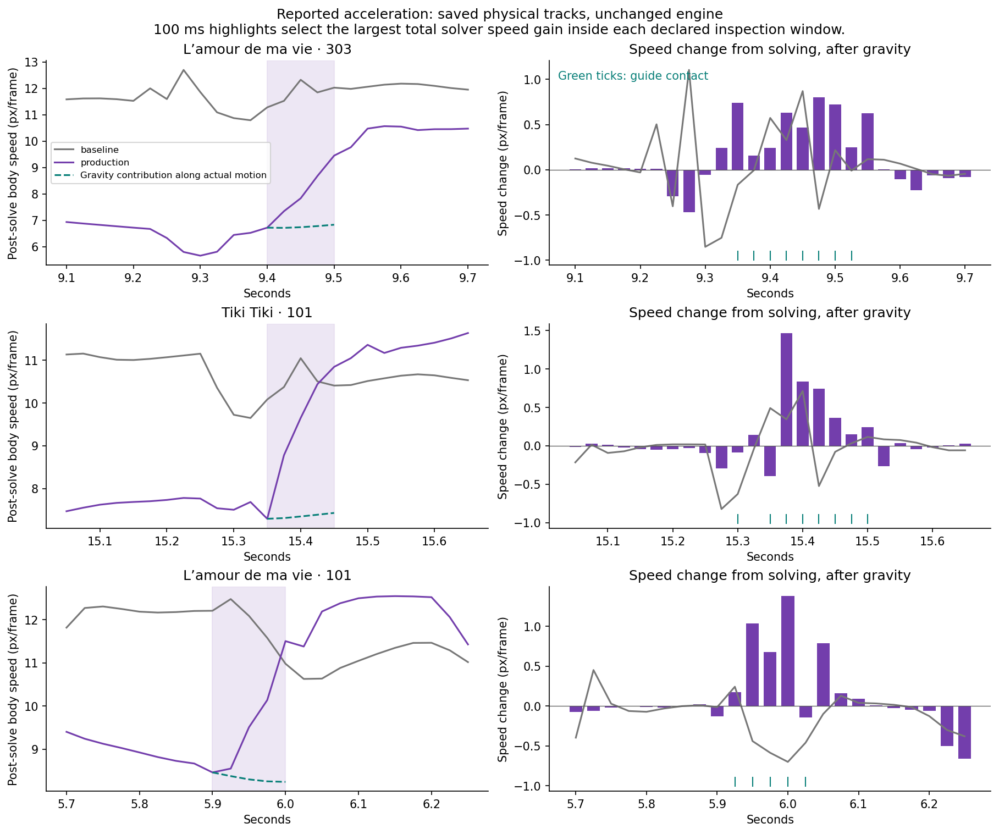
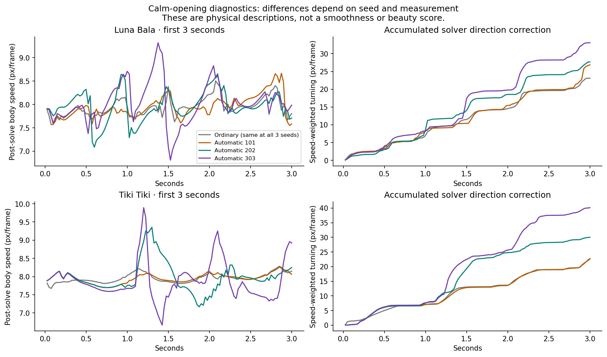
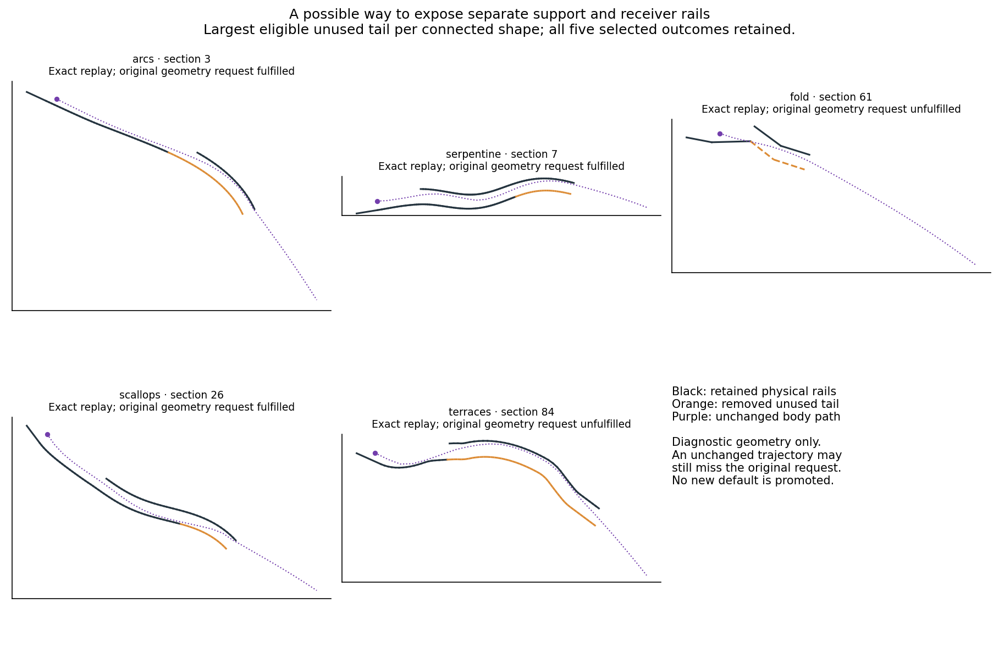

# Motion quality: investigation before the next roadmap

The [owner's review](production-repertoire-feedback-20261001.md) strongly confirms
the direction of automatic repertoire production. Preserve its variety and the
successful discussion → roadmap → approval → sustained execution workflow.
This investigation addresses the specific acceleration examples, calmer openings,
and the attractive transfer from sliding support to a later control rail.

**The reported acceleration is real. Normal type-0 lines can add speed through
the original engine's direction-dependent friction correction.** The effect is
not specific to the new geometry, and a narrowing two-rail corridor is not required.
All three flagged automatic examples show substantial speed gains beyond gravity.

This is an investigation, not a new production policy or a changed benchmark.
The delivered compiler, physics, V5, saved tracks and dashboard are preserved.
No vertical videos were regenerated. Future routine artistic review can use the
faithful native player with music; finished rendering remains available as needed.

## Evidence and scope

- Replayed every delivered comparison: 24 records, comprising 12 distinct automatic
  tracks and six distinct ordinary tracks across four actual songs. Every line is
  type 0. All ten physical point positions match the saved trajectories exactly.
- Replayed the three named cases in both modes with the untouched published
  JavaScript engine. Every physical point's position, previous position and stored
  velocity match the WASM engine exactly through the inspected windows.
- Inspected every solver update for five frames around each local peak, performed
  20 isolated normal-line collision assays, and ran six local guide-removal tests.
- Examined all three seeds for the Luna and Tiki openings, the full collection's
  speed-change distribution, and lower-support → later-guide transfers.
- Tested five unused-tail removals through complete native replays and the frozen
  construction checker. All selected outcomes, including request failures, remain
  in the evidence.

These are four known recordings, not an unseen music sample. Repeated ordinary
references are paired comparisons, not independent seed observations. The study
does not estimate how often a viewer will dislike a motion or define a beauty score.

[Compact evidence](evidence/motion-quality-20261001.json) records identities,
measurements, counterfactuals, collision assays and per-track summaries. Large raw
time series and detailed solver updates remain under `generated/motion-quality-20261001/`.

## The three examples

The table selects the largest total solver speed gain over **100 ms** inside each declared
inspection window around the owner's timestamp. Speed is the six-body-point mean
post-solve displacement velocity, in engine pixels per 40 Hz frame. This follows
the physical frame's response; the engine exposes it as stored velocity on the
next frame after adding gravity. It is not a camera or playback-speed measurement.

| Automatic arrangement | Construction | Interval | Speed before → after | Increase | Gravity contribution | Solver contribution |
|---|---|---|---:|---:|---:|---:|
| L’amour de ma vie 303 | S sweep | 9.400–9.500 s | 6.723 → 9.452 | 40.6% | +0.111 | +2.618 |
| Tiki Tiki 101 | Scattered | 15.350–15.450 s | 7.296 → 10.845 | 48.6% | +0.136 | +3.412 |
| L’amour de ma vie 101 | Guided ordinary arc | 5.900–6.000 s | 8.461 → 11.502 | 35.9% | −0.219 | +3.259 |

For every frame, we measure gravity's change in speed from the actual incoming
state, then the solver's remaining change. Summing these terms reproduces the
observed speed change exactly. **This respects the actual changes in direction**,
including beneficial steering that lets gravity accelerate the rider. It does not
compare a steered path with an assumed straight ballistic path and call the whole
difference artificial. Gravity changes velocity by 0.175 px/frame per step; even
its maximum possible four-step speed gain is 0.7. The contact/constraint contribution
in these examples is substantial, without establishing that every such contribution
is undesirable. The raw study also preserves a separately labeled free-flight
prediction diagnostic; that simpler counterfactual is not this exact decomposition.



The ordinary references show related behavior, although not the same magnitude or
exact peak time. Their incoming states differ, so comparing their speed traces
does not isolate geometry as the only cause.

## The mechanism is more specific than squeezing

[`SolidLine.collide`](../vendor/lr-core/line-rider-engine/lines/SolidLine.js) projects
a contacting point out of the line and modifies its previous position to implement
friction. The next integration step obtains velocity from current minus previous
position. Depending on slope and contact side, that previous-position correction
can **increase tangential speed**. The Rust kernel reproduces the same arithmetic;
this is not a divergence introduced by the optimized engine.

An isolated horizontal-line assay makes the distinction unambiguous. It uses the
real PEG point's friction of 0.8, tangential speed 5, normal approach speed 1 and
penetration 2. The normal projection reverses the normal component without changing
its magnitude. On the supporting side the friction correction changes tangential
speed from 5 to **3.4**; on the opposing side it changes it from 5 to **6.6**. Both
lines are type 0. There is no gravity step, second rail or coupled rider in this
single-collision assay. Both travel directions reproduce the result. The full
20-case assay also varies slope: the sign is orientation dependent, so neither
“all upper contacts boost” nor “all lower contacts brake” is a general law.

In the actual automatic examples, the guide collisions' previous-position
correction adds more of the measured kinetic proxy than their position projection
removes. Over five frames around each one-frame peak:

| Case | Guide projection contribution | Guide friction contribution | Net guide collision contribution |
|---|---:|---:|---:|
| L’amour 303 | −25.808 | +56.570 | +30.762 |
| Tiki 101 | −2.826 | +28.793 | +25.967 |
| L’amour 101 | −11.229 | +53.893 | +42.665 |

The proxy is the mean `0.5 × |position − previousPosition|²` over all ten physical
points. The split evaluates position correction first, previous-position correction
second; its signed terms sum exactly to the collision's change. It is an ordered
algebraic diagnostic, not calibrated mechanical energy. Other constraint updates
also redistribute motion between the sled and body, sometimes delaying a visible
body-speed increase until after the last guide collision.

Removing the selected local guide reduces the largest one-frame excess speed gain
from 0.801 to 0.242, 1.468 to 0.143, and 1.378 to 0.132 respectively. Each modified
ride has an identical prefix until the first affected collision. The ordinary
examples respond similarly. These are mechanism checks: the altered riders remain
mounted through the short inspection windows, but we do not claim that they satisfy
the remaining music, requested shape or complete-track validity. Simply deleting
guides is not a demonstrated production fix.

The owner's narrowing-rail observation remains plausible as an amplifier of
penetration or repeated contact. This study does not isolate its contribution in
each passage. The single-line assay shows that narrowing is not necessary, and
the actual traces include accelerating guide contacts without simultaneous lower
contact. A later, separate receiver rail can exhibit this physics too.

## Why current scores do not fully express the concern

The current impact contract measures speed-weighted **turning** around an authored
landing, through landing+6 frames, with contact gating. Increasing speed along a
nearly unchanged heading is a different quantity. Substantial steering or speed
change later in the support lies outside that landing window. The score's speed
axis is a gap average; it can match despite a slow-then-fast trajectory.

There is also a timing detail worth making explicit: solving frame `f` changes the
position-derived velocity, which becomes the stored velocity at `f+1`. Our
coverage diagnostic applies the existing impact window and contact gate at that
next sample. This follows the existing engine/score contract; it does not change it.
The measured identity also offers an efficient implementation path: the next
stored velocity minus gravity gives the current post-solve velocity. Existing
native trajectory windows can support these diagnostics; the detailed upstream
per-update oracle belongs in studies, not every candidate's search loop.

For an illustrative cut at an extra **0.5 px/frame in one solve**, the paired full
collection has the following counts, excluding the physical outro:

| Mode | Frames above the cut / all frames | With guide contact | Outside the landing-impact window or gate |
|---|---:|---:|---:|
| Ordinary references | 938 / 21,906 | 909 | 723 |
| Automatic arrangements | 698 / 21,906 | 647 | 451 |

At the larger cut of 1 px/frame, the counts are 76 ordinary versus 109 automatic.
Thus the automatic collection has fewer moderate events by this description but
more large ones. It would be misleading to call every aspect globally worse or
to attribute the phenomenon exclusively to the new repertoire. These cut points
are descriptive bands, **not proposed acceptable/unacceptable thresholds**.

Normal-line validation, geometric fulfillment, musical accuracy and motion quality
answer different questions. None alone establishes the others. A blanket penalty
on all contact motion would also punish useful steering, landings and expressive
movement. The new diagnostics deliberately separate speed change, direction
change, contact role and musical context.

## The calm openings need both better realization and better intent

The current policy uses seed, support timing, authored boundaries and broad creative
preferences to select constructions. **It does not condition those choices on
requested impact or speed.** The realizer subsequently tries to satisfy the music
inside the chosen request. This explains why an expressive guided phrase can be
requested during a calm opening; it is a limitation of the provisional arrangement
policy, not a mysterious accidental choice by the gallery.

During Tiki's first three seconds, the total absolute solver speed correction is
2.45 for the ordinary reference and **2.25 / 8.16 / 13.74** for automatic seeds
101 / 202 / 303. Speed-weighted direction correction is 22.56 ordinary versus
**22.76 / 30.02 / 40.13** automatic. Seed 101 is close on these diagnostics;
303 is substantially more active. Luna's corresponding turning totals are 23.13
ordinary versus **26.87 / 27.69 / 33.07** automatic. These totals describe motion,
not its aesthetic value or an objective requirement to minimize it.

Some of the problem is already visible to the current score. Tiki's first three
contacts request impact 0.02. The ordinary landing-impact RMS error is 0.0126;
automatic errors are 0.0201 / 0.0542 / 0.0484. Luna requests 0.06 and has 0.0028
ordinary versus 0.0112 / 0.0171 / 0.0267 automatic. Improving the current compiler
can address those mismatches without a new benchmark. Additional within-support
motion remains a separate question that the current landing quantity does not cover.



Low impact is useful musical context, but it is not a complete definition of calm.
Arrival speed, a forthcoming stronger beat, deliberate flight and phrase intent
also matter. The next design should preserve energetic passages and quiet ones
intentionally, with evidence on each, rather than reduce guide count everywhere.

## Separate support and later control: a concrete opportunity

Actual contact timelines already contain this sequence in connected constructions.
Across the twelve automatic tracks, final guide-only interaction follows at least
one collision-free frame in 30 arc, 23 S, 6 fold, 13 ripple and 18 terrace supports,
as well as 30 scattered supports. Some of those guides were also touched earlier:
these counts establish a final transfer, not an exclusively two-stage ride.

There are **90 connected supports** in this inventory with an unused lower-rail
tail after its last contacted segment. As a bounded test, we selected the longest
eligible tail per connected construction and removed only never-contacted segments.
All five complete replays preserve every physical point's position, previous
position and velocity exactly, and preserve every frame's collision-ID set.

There is a meaningful contract distinction: the trimmed arc, S and ripple still
pass their existing construction checks; the trimmed fold and terrace do not.
The fold loses required lower-rail corners and the terrace loses lower-rail
reversals, even though their actual rides are identical. Their failures are retained.
We should not silently weaken the current checker or call those variants qualified.



This supports exploring rail extent and placement as an intentional construction
option before inventing a large new primitive hierarchy. It does not establish
that automatic trimming everywhere looks better. Full paired rails sometimes
create exactly the strong visual shape the owner likes, and a useful new variant
needs its own clear functional and visual contract.

## What this suggests for the next discussion

1. Keep separate, interpretable descriptions of speed surges, steering and contact
   timing over the whole passage. Calibrate a small set of desired/undesired examples
   with native playback before turning any description into a universal penalty.
2. Develop guide/contact realization that avoids excessive friction-driven boosts
   when they are unwanted, while preserving meaningful geometry and intentional
   energetic motion. Investigate entry state, guide orientation, engagement depth,
   repeated contacts and useful future planning. Changing the physics is not needed
   to study better geometry and search.
3. Make arrangement sensitive to musical context, and explore deliberate transfers
   to later control rails. Keep quiet passages and varied expressive passages in
   the same production system; avoid hardcoded song introductions or mandatory
   per-beat geometry annotations.
4. Retain musical accuracy as a major objective, with a possible next ambition
   around 850. Keep V5 frozen as a comparison. If we revise automatic requests or
   add a scored motion contract, freeze that explicitly as a new version after
   the desired behavior is clear. A lower score caused by a stricter task is not
   the same as a compiler regression.

These are inputs to the next roadmap, not an already approved new campaign or a
claim that a single regularizer solves the problem. The new numerical diagnostics
have not yet been calibrated against a broad set of artistic judgments.

## Reproduction and validation

```sh
node --import tsx scripts/gallery/study_motion_quality.ts
node --import tsx scripts/gallery/study_motion_tail_pruning.ts
npx tsc --noEmit --allowImportingTsExtensions --pretty false \
  > generated/motion-quality-20261001/typecheck.txt 2>&1
python3 scripts/gallery/report_motion_quality.py
```

The study verifies artifact checksums, normal line types, exact saved/native replay,
reference-engine parity, integrator timing, an undeformed free-flight control,
the per-collision decomposition and counterfactual prefix identity. Tail experiments
check full point state and contact equality as well as construction conformance.
The type check retains the same 251 pre-existing diagnostics, byte-for-byte; no new
study-file errors remain. Code and compact evidence are versioned; raw archives stay
local. No compiler/scorer/engine changes or new headline claims accompany this study.
