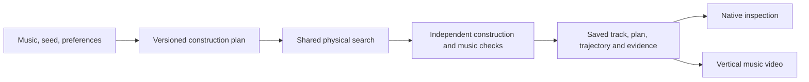

# How automatic repertoire production works

The product makes a complete musical ride from a specification, seed and broad
preferences. It deliberately chooses open passages, guided shapes and scattered
passages before searching their geometry. The dashboard, CLI and V6 evaluation
use the public `compileHandoff` entry point and the versioned V2 arrangement policy.
Frozen V5 retains its V1 policy. The ordinary profile remains available
for comparison and existing callers; creative production is an explicit option.

## What decides whether there is a control rail?

The automatic policy decides the request. Search decides the concrete geometry.
These are separate, inspectable decisions:

| Request | Search obligation |
|---|---|
| Ordinary arc, guide forbidden | Build the support without an opposing rail |
| Guided arc, fold, S sweep, ripple or terraces | Build substantial requested geometry and demonstrate the required guide interaction; shaped requests also require ordered traversal |
| Scattered | Build and replay contacted, disconnected normal fragments; no connected-guide toggle |
| Ordinary reference, guide optional | Permit guides for accuracy, then prune unused geometry |

Thus a guided fold is not an accidental side effect of guide permission, and an
open arc does not acquire a guide merely because it would be easier to optimize.
There is no rule saying “add guides until musical error falls below a threshold.”
The automatic planner sets the requested visual contrast; shared physical search
tries to fulfill it accurately within the allowance. It records a failure if it
cannot. It does not silently reroll the plan or replace a fold with an ordinary arc.

At the default preferences, an energetic context starts with weights of 30% open
arcs, 55% guided connected construction and 15% scattered. V2 derives a continuous
quiet-context value from authored impact and speed targets. Increasing quietness
reduces guided and scattered preferences, leaving more room for smooth open arcs.
Unknown impact does not imply calm, and low-impact fast riding remains possible.
This is an explicit small heuristic, not a learned understanding of the music.

Consecutive supports normally repeat for two or three beats. Authored phrase
boundaries and substantial target changes can shorten a group. Immediate repetition
of the same construction/guidance choice has one-quarter its usual weight.
Among guided phrases, the seeded transfer preference varies from 20% in an
energetic context to 10% in the quietest context; paired shapes remain available.
These are sampling weights, not promised fractions of supports or screen time.
Each saved phrase records its eligible choices and their actual weights. The
ordinary startup is explicit. The policy cannot select a new plan after seeing
whether the search succeeds.

`variation`, `guidedBalance` and the allowed `repertoire` adjust this policy.
A separate seeded random stream makes the requested plan reproducible and keeps
it fixed when the physics allowance changes. No musical target is randomized by
the variety policy. Infeasible combinations of preferences are rejected.

## One shared search

`production_repertoire.ts` turns the plan into section styles and construction
requests, then invokes `compileArcMotion` once. Proposals, lookahead, backtracking
and recovery evaluate the actual selected construction. Musical loss and physical
request checks both participate; a good musical score cannot excuse a skipped fold.
Response memory is shared within compatible construction contexts rather than
treating an ordinary arc's response as the same as a fold's.

Connected constructions use the existing pure geometry builders and control
registry. Search checks physical realization over the saved **authored** interval,
even when musical contact scheduling uses its unchanged timing tolerance. Final
geometry may use the established physical outro; this does not extend the scored
music. A full fold omits the smooth-bend search coordinate that cannot affect its
geometry. Partial folds retain it.

Scattered construction is integrated into the same search. It observes contacts
for a local connected candidate, retains short normal fragments around those
contacts, and replays the actual fragments with the native engine. The resulting
physical exit becomes the next interval's entry. The observer reuses immutable
prefixes. This avoids a complete source-track compile followed by repeated suffix
rebuilds for every scattered passage. Fragmented supports remain exempt from
connected-guide pruning. Earlier direct controllers and manual composition remain
explicit research tools; the dashboard does not run a second production compiler.

## What the evidence does and does not establish

The independent checker reads emitted lines and native collisions. It checks
normal-line geometry, substantial shape, guide interaction, ordered contact
progress and meaningful fragmentation. It rejects untouched guides and bypassed
shapes. Opposing-rail contact can establish progress through a shape; continuous
contact with the lower support is not required. The checks do not certify beauty,
every bend's contact, or that no alternative unguided construction could work.

One compile allowance covers proposals, failed attempts, contact observation,
fragment reconstruction, continuation and compiler verification. The ordinary
comparison, independent benchmark judgment and video rendering have separately
reported costs. Cached reference reuse records both original and current work.
Budget growth is not assumed to produce monotonically better music scores.

Saved identities cover authored inputs, audio, analysis, jolt, compiler, policy,
preferences, plan and render recipe. Native playback verifies recorded rider body
points. Finished video uses the saved physical track, with the established music,
camera, overlays and post-processing; rendering does not choose new geometry.

## Deliberate transfers and motion

Guided connected constructions have two layouts. A paired layout keeps the
familiar support and opposing rail. A transfer requires support contact, a real
collision-free interval and subsequent receiver contact while the rider is beyond
the lower support. Folded and terraced transfers must still engage their meaningful
corners; smooth shapes retain meaningful reversals. This is checked from emitted
geometry, all rider-body contacts and native positions. Deleting a lower tail and
retaining an old label is insufficient.

The receiver proposal observes the rider's actual free-flight body pose and fits
a connected upper rail to that approach. Shared search adjusts its entry, direction,
extent and release, then checks the resulting ride and continuation. Scatter
retains its distinct disconnected representation and the same motion scrutiny.
All emitted physical segments remain normal type 0; the native engine is unchanged.

Motion observations distinguish gravity along the trajectory from the remaining
solver speed change, in 25, 100 and 250 ms windows. Calm-passage observations also
cover corrections after the landing. Search uses these observations alongside
musical error and required shape engagement. They are not a replacement musical
score or a universal beauty penalty. In particular, a high requested impact does
not authorize arbitrary later speed bursts.

The V2 search includes construction-specific proposals and response memory,
bounded reconsideration of a preceding transition when current musical error is
large, and a small incumbent-preserving ending refinement. Every attempted branch
uses the same physics meter. Broader repair and value-model experiments that did
not justify production defaults are preserved on
`research/intentional-motion-repair-20261001`.

## Where to make changes

| Responsibility | Implementation |
|---|---|
| Authored musical context | `scripts/v0/optimizer/repertoire_context.ts` |
| Seeded V2 arrangement and phrase choices | `scripts/v0/optimizer/intentional_repertoire.ts` |
| Shared production search configuration | `scripts/v0/optimizer/repertoire_search.ts` |
| Geometry, continuation and bounded work | `scripts/v0/optimizer/arc_motion.ts`, `arc_refinement.ts`, and construction modules |
| Motion observations / mutable search objective | `scripts/v0/optimizer/motion_quality.ts` / `motion_objective.ts` |
| Independent layout conformance | `scripts/v0/optimizer/repertoire_layout.ts` |
| Frozen benchmark / production motion qualification | `benchmark/v6/`, `scripts/benchmark/qualify_production_motion.ts` |

The V6 catalog binds policy, saved requests, layout checks and motion bands. Search
can improve against that contract; changing the task itself requires explicit
versioning. The search objective remains separately adjustable. V1 and the ordinary
profile retain their historical options so frozen V5/V4 comparisons are reproducible.

See [production commands](automatic-production.md), the
[current campaign ledger](intentional-motion-campaign.md), and the
[frozen V6 contract](../benchmark/v6/README.md). Remaining musical error and
construction failures belong in those results, not in hidden fallback rules.
