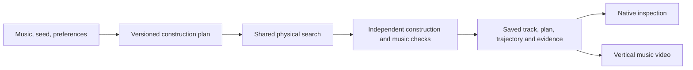

# How automatic repertoire production works

The product makes a complete musical ride from a specification, seed and broad
preferences. It deliberately chooses open passages, guided shapes and scattered
passages before searching their geometry. The dashboard, CLI and V5 evaluation
use the public `compileHandoff` entry point. The ordinary profile remains available
for comparison and existing callers; creative production is an explicit option.

## What decides whether there is a control rail?

The automatic policy decides the request. Search decides the concrete geometry.
These are separate, inspectable decisions:

| Request | Search obligation |
|---|---|
| Ordinary arc, guide forbidden | Build the support without an opposing rail |
| Guided arc, fold, S sweep, ripple or terraces | Build substantial requested geometry and demonstrate the required guide interaction; shaped requests also require ordered traversal |
| Scattered | Build and replay contacted, disconnected normal fragments; no connected-guide toggle |
| Ordinary reference, guide optional | Permit guides for accuracy, then prune unused geometry |

Thus a guided fold is not an accidental side effect of guide permission, and an
open arc does not acquire a guide merely because it would be easier to optimize.
There is no rule saying “add guides until musical error falls below a threshold.”
The automatic planner sets the requested visual contrast; shared physical search
tries to fulfill it accurately within the allowance. It records a failure if it
cannot. It does not silently reroll the plan or replace a fold with an ordinary arc.

Default phrase-choice weights are 30% open arcs, 55% guided connected construction
(evenly divided among five choices), and 15% scattered. Consecutive supports
normally repeat for two or three beats. Authored phrase boundaries can shorten a
group, and immediate repetition of the same choice is discouraged. These weights
are preferences, not promised fractions of screen time. They are a first artistic
hypothesis, not a model of musical expression. The ordinary startup is explicit.

`variation`, `guidedBalance` and the allowed `repertoire` adjust this policy.
A separate seeded random stream makes the requested plan reproducible and keeps
it fixed when the physics allowance changes. No musical target is randomized by
the variety policy. Infeasible combinations of preferences are rejected.

## One shared search

`production_repertoire.ts` turns the plan into section styles and construction
requests, then invokes `compileArcMotion` once. Proposals, lookahead, backtracking
and recovery evaluate the actual selected construction. Musical loss and physical
request checks both participate; a good musical score cannot excuse a skipped fold.
Response memory is shared within compatible construction contexts rather than
treating an ordinary arc's response as the same as a fold's.

Connected constructions use the existing pure geometry builders and control
registry. Search checks physical realization over the saved **authored** interval,
even when musical contact scheduling uses its unchanged timing tolerance. Final
geometry may use the established physical outro; this does not extend the scored
music. A full fold omits the smooth-bend search coordinate that cannot affect its
geometry. Partial folds retain it.

Scattered construction is integrated into the same search. It observes contacts
for a local connected candidate, retains short normal fragments around those
contacts, and replays the actual fragments with the native engine. The resulting
physical exit becomes the next interval's entry. The observer reuses immutable
prefixes. This avoids a complete source-track compile followed by repeated suffix
rebuilds for every scattered passage. Fragmented supports remain exempt from
connected-guide pruning. Earlier direct controllers and manual composition remain
explicit research tools; the dashboard does not run a second production compiler.

## What the evidence does and does not establish

The independent checker reads emitted lines and native collisions. It checks
normal-line geometry, substantial shape, guide interaction, ordered contact
progress and meaningful fragmentation. It rejects untouched guides and bypassed
shapes. Opposing-rail contact can establish progress through a shape; continuous
contact with the lower support is not required. The checks do not certify beauty,
every bend's contact, or that no alternative unguided construction could work.

One compile allowance covers proposals, failed attempts, contact observation,
fragment reconstruction, continuation and compiler verification. The ordinary
comparison, independent benchmark judgment and video rendering have separately
reported costs. Cached reference reuse records both original and current work.
Budget growth is not assumed to produce monotonically better music scores.

Saved identities cover authored inputs, audio, analysis, jolt, compiler, policy,
preferences, plan and render recipe. Native playback verifies recorded rider body
points. Finished video uses the saved physical track, with the established music,
camera, overlays and post-processing; rendering does not choose new geometry.

See [production commands](automatic-production.md), the
[campaign ledger](production-repertoire-campaign.md), and the
[frozen V5 contract](../benchmark/v5/README.md). Remaining musical error and
construction failures belong in those results, not in hidden fallback rules.
